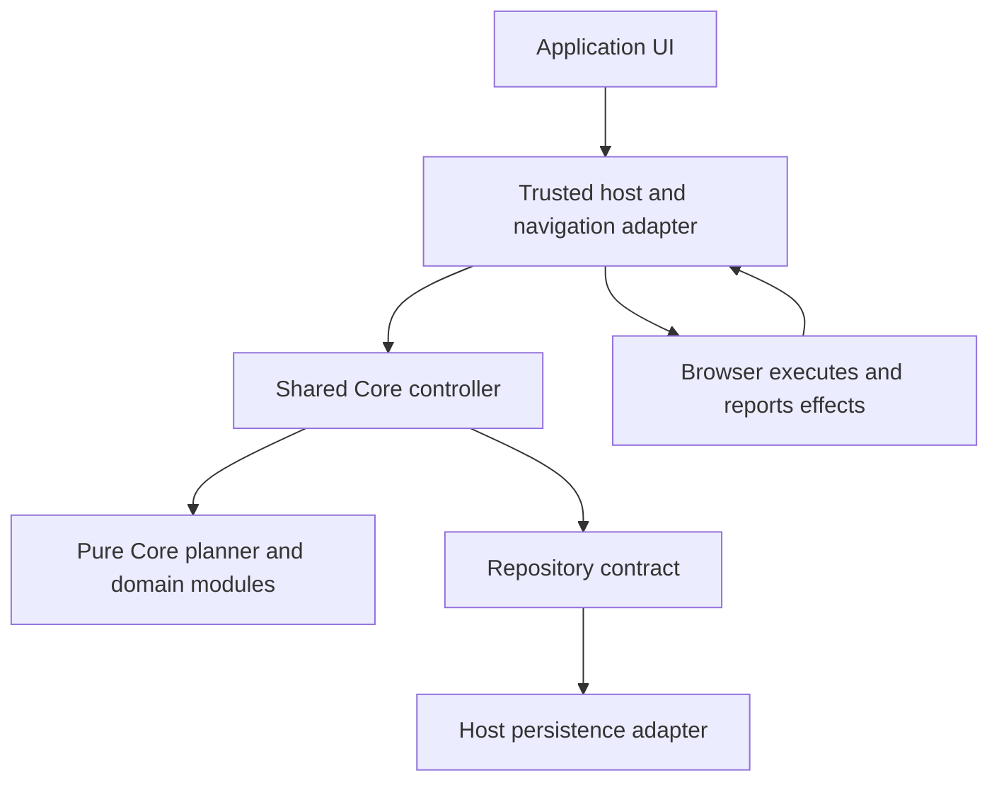

# Atlas Core architecture

Status: Milestones 1 through 3, D11 Journeys, and D13 aggregate validation/planning implement pure domain logic. D14 adds commit coordination with repository/clock interfaces. D15 adds the first Firefox development adapter and extension-origin repository without changing Core's public API. Requirements and settled decisions live in [foundation.md](foundation.md).

## Current package

`packages/core` is the only package. Its public exports include policy evaluation, target normalization, Greylist access transitions, Vault proposal/review/commit preparation, and Journey transitions, with readonly domain models.

| Module | Responsibility |
| --- | --- |
| `models.ts` | Small readonly domain models and distinct decision variants. |
| `target.ts` | Request normalization and the shared hostname validator. |
| `policy.ts` | Validate and normalize both complete policy lists into fresh arrays. |
| `evaluate.ts` | Validate inputs, check Blacklist first, then Whitelist, then return Greylist. |
| `access-models.ts` | Pending requests, grants, access state/context, timing, and result variants. |
| `access-state.ts` | Explicit initialization; validate and copy complete workflow state, configuration, and context. |
| `access.ts` | Derive temporal access decisions and compute explicit request/grant transitions. |
| `vault-models.ts` | Policy proposals, Vault state/context, review, and commit-candidate results. |
| `vault-state.ts` | Validate and copy Vault state/context and freeze returned snapshots. |
| `vault.ts` | Create/cancel frozen proposals, derive reviews, and prepare complete commit candidates. |
| `journey-models.ts` | Bounded Journey records, context, limits, decisions, and transitions. |
| `journey-state.ts` | Initialize, validate/copy/freeze state, and observe expiry or policy invalidation. |
| `journey.ts` | Start attempts, evaluate/record navigation, cancel, and close contexts. |
| `atlas-models.ts` | Aggregate snapshot, configuration, closed operations, assessments, and candidate plans. |
| `atlas-state.ts` | Reuse component validators to validate/copy/freeze complete snapshots. |
| `atlas-planner.ts` | Combine authorization, observations, and complete candidate transitions using explicit time. |
| `atlas-ports.ts` | Repository, clock, versioned envelope, and commit outcome contracts. |
| `atlas-controller-models.ts` | Owner lifecycle, committed responses, failures, and readonly views. |
| `atlas-controller.ts` | Serialize operations, load/validate authority, coordinate commits, and reconcile uncertain outcomes. |
| `index.ts` | Public exports; policy validation remains internal. |

`evaluate(requestedSite, currentPolicy)` validates plain input data at runtime. It returns a new decision with a stable reason and, for valid inputs, a normalized target. It retains no state and performs no external effects. Invalid policy takes precedence over invalid target when both are malformed. `normalizeTarget` returns a fresh target or `null`; a normalized target carries no permission.

Access operations take `{ policy, policyRevision, state, now }`. `evaluateAccess` returns `{ decision, nextState }`; command functions return an `AccessTransition` with `ok`, a result/reason, and `nextState`. All valid-context calls return copied observation state, including rejections. Only accepted commands alter pending requests or grants. Invalid context returns `nextState: null` and cannot initialize replacement state.

Keep threading non-null `nextState` into subsequent calls: it carries `lastObservedAt` and the latest policy revision. This permits pure rollback checks without hidden mutable clocks. `evaluate` remains policy-only and cannot be used to inspect grants. `createAccessState` is explicit fresh initialization, never a corrupt-state recovery fallback.

Tests are JavaScript files using `node:test` against the compiled public entry point. Source has no Node imports or browser integration. The DOM type library supplies standard `URL` and `structuredClone` declarations; code does not access the DOM. The controller calls only injected repository/clock ports; their concrete production implementations remain outside Core. Commands and evidence live in the root README.

## Language choice

TypeScript (P1) was adopted for Milestone 1. The policy workload is validation, matching, deadline arithmetic, and state transitions. Native performance is not an initial requirement. The original comparison supporting this choice is retained below.

| Candidate | Fit for these consumers |
| --- | --- |
| TypeScript | Compiles to JavaScript usable in both Firefox background code and Electron main code. One implementation and test corpus, without a separate language service. |
| C# | Strong domain tooling, but browser-extension reuse needs an extra runtime, WebAssembly integration or a process boundary. Do not choose it merely because Zenith used it. |
| Rust | Could run through WebAssembly, with strong language guarantees; adds build and interoperation work for a small policy library. |
| Python | Good general business logic, but browser deployment requires an interpreter or external service rather than an ordinary JavaScript import. |

TypeScript's types disappear at runtime, and `readonly` alone does not prevent mutation. Validate decoded data and incoming commands, keep internal state private, and return safe snapshots. Use strict compiler settings, exhaustive result handling, bounded numeric values and a small public API.

The package emits JavaScript ES modules and type declarations and stays private during initial development. Keep Core free of `electron`, extension APIs, Node-only APIs, DOM access, React and networking. Standard target parsing can be shared without a browser dependency, but its normalization contract must be tested in each claimed runtime. Current tooling is npm, Node.js 24, TypeScript 6.0.3, and Node's built-in test runner; no validator or runtime dependency is needed.

## Dependency direction

The coordinator and external contracts below describe later milestones, not current modules.

```text
Browser events / application UI
            |
            v
Trusted interface adapter --------> Browser engine
            |                      (execute/present decision)
            v
Atlas Core application coordinator
            |
            +--> Pure policy evaluation and transitions
            |
            +--> Repository / clock / ID-source contracts
                         ^
                         |
                Platform implementations
```

Core depends on contracts it defines, not on the code implementing storage or a browser. The coordinator is ordinary application logic: load, validate, transition, commit and publish. It is not a browser service, scheduler or dependency-injection framework.

## Suggested repository layout

The implemented milestones use the small flat source layout described above. The larger tree below is a future sketch. Add directories only when they acquire a real purpose.

```text
AtlasCore/
  README.md
  AGENTS.md
  docs/                       product contract, architecture, tests, decisions
  packages/
    core/
      src/
        index.ts              deliberately small public API
        policy/               identity, classification, evaluation
        access/               waits, confirmations, grants
        vault/                proposed policy changes and transitions
        journey/              bounded runtime navigation authorization
        state/                serializable records and validation
        runtime/              commit coordinator and external contracts
      tests/                  unit, transition and repository-contract tests
  adapters/
    firefox/                  browser mapping, messaging and storage adapter
    electron/                 browser mapping, messaging and storage adapter
  tests/
    conformance/              shared behavioral scenarios for later adapters
```

The folder names are suggestions, not a mandate to create empty layers or a class per concept. Start smaller and split a module when its responsibilities justify it. Introduce a separate published package only for an actual independent consumer or dependency boundary.

## Two domain operations

**Evaluate:** validated snapshot + requested action + time -> decision.

**Transition:** validated state + explicit command + time -> proposed next state + result. Milestone 2 allocates IDs from its state counter; no external ID service or event system is needed.

Evaluation must not begin waits, issue grants or mutate policy. A transition computes effects but does not open a browser, schedule a timer or write a file. The coordinator publishes a committed transition only after storage confirms it.

The public API includes explicit access, Vault, and Journey operations. The workflow sections below own their individual contracts.

Do not create a general event-sourcing system. A snapshot and a bounded, optional record of significant user actions are sufficient candidates.

## Greylist workflow (Milestone 2)

Status: adopted through foundation D9 and implemented as pure domain logic. The state-machine rules below are implemented; references to durable commits describe requirements for a future coordinator/storage implementation. Returning a successful candidate transition does not acknowledge a save. Milestone 1's policy-only evaluator is unchanged.

### Invariants and proposed scope

Greylist is a policy classification. A grant may temporarily authorize that hostname without changing its classification. Only explicit final confirmation can create a grant through the domain transitions; a future owner must persist that transition before exposing access. Evaluation, starting a request, elapsed time, and restart cannot create a grant.

Use the existing exact normalized hostname scope. Commands are explicit Start(target), Confirm(requestId), and Cancel(requestId); untrusted command data cannot select authoritative timestamps or widen an existing request. The trusted owner supplies context and timing separately. Start itself satisfies G01's initial confirmation, and each hostname has at most one pending request or grant record. Different hostnames have independent workflows. Starting again during an unexpired, current request returns that request unchanged; starting while its grant is active is rejected. Every Start, including a retry, requires valid timing configuration; changed timing values never rewrite an existing request.

Timing uses three positive safe integer millisecond durations supplied by trusted Core configuration: wait W, confirmation window C, and grant duration G. Production values remain undecided; the domain provides no defaults. Freeze these terms when Start is accepted: readyAt = startedAt + W, confirmBy = readyAt + C. This bounded confirmation window prevents old completed waits from remaining usable indefinitely. Grant expiry is issuedAt + G; it is never extended by evaluation or retries. Timestamp arithmetic must remain within safe integer bounds.

### States

| State | Meaning and access result |
| --- | --- |
| Unknown / Greylist | No live request or usable grant for this hostname. Return GREYLIST; evaluation creates nothing. |
| Access request started | An explicit Start has been accepted and its pending record committed. This is a transition event, not another persistent phase. Derive Waiting, readiness, or request expiry from the original deadlines and current accepted time; a slow commit must not reset those deadlines. |
| Waiting | A pending record exists and now < readyAt. Return WAIT; no permission. |
| Confirmation available | readyAt <= now < confirmBy. Return REQUIRE_CONFIRMATION; no permission. |
| Grant active | A grant is committed, issuedAt <= now < expiresAt, and current policy/time/state checks succeed. Return ALLOW for its exact hostname. |
| Grant expired | now >= expiresAt. Return GREYLIST with an expiry reason; no automatic renewal. |
| Cancelled request | An explicit Cancel has durably removed the pending request. Return GREYLIST; that request ID can never confirm. |

Waiting/readiness are views of one pending record; active/expired are views of one grant. Cancelled is a terminal result for a request, not a requirement to store permanent history. Blacklist or invalid authorization state overrides all access results above with DENY. A newly Whitelisted target follows ordinary policy; it does not gain a Greylist grant automatically.

### Valid and invalid transitions

| From | Trigger and guard | Result |
| --- | --- | --- |
| Greylist, expired grant, or cancelled request | Explicit Start; current target is Greylist and state/time/configuration are valid | New unique pending request; full wait W is measured from its newly accepted startedAt. Publish Start success only after commit. |
| Waiting | Accepted time reaches readyAt | Confirmation becomes available; no write, timer callback, or permission is implied. |
| Waiting or confirmation available | Repeated Start for the same hostname | Existing request and deadlines are unchanged. |
| Confirmation available | Explicit Confirm of that live ID, before confirmBy, with current valid policy | Propose one grant and consume the pending request in the same commit. Reevaluate after commit before publishing an access decision. |
| Waiting or confirmation available | Explicit Cancel of that live ID | Remove pending request after successful commit; future Start requires a new ID and full wait. |
| Confirmation available | Accepted time reaches confirmBy | Request expires; return GREYLIST. Confirmation is rejected even if the expired record has not been cleaned up. |
| Grant active | Accepted time reaches expiresAt | Grant expires; return GREYLIST. Another grant requires a fresh Start, wait, and confirmation. |

Reject confirmation before readiness, at/after confirmBy, for a missing/wrong/consumed/cancelled ID, or against invalid/stale state. Cancel also requires a current, unexpired pending request; it is not a grant-revocation command. Reject malformed targets, unsupported scope, invalid durations/time, and command-supplied deadline overrides. Rejections never mutate inputs, change workflow records, or create/extend a grant. With valid context they still return an observation-only `nextState`: accepting the observed time/revision prevents a later backward input from reopening an expired window. Replayed confirmation does not revoke an already issued grant either; its original expiry still applies.

Every evaluation and confirmation checks current policy, with Blacklist precedence. The adopted Q8 rule makes an existing request or grant stale on any policy revision mismatch; it cannot authorize or confirm, and a currently Greylisted target must start fresh. This includes unrelated policy edits. The trusted owner must advance the revision for every edit. Context revisions older than the last returned state's revision are rejected. Milestone 2 introduces no policy-edit workflow.

### Persistence contract, without an implementation

Keep only live records and the metadata needed to validate them:

- Pending request: unique non-reused request ID, normalized hostname, startedAt, readyAt, confirmBy, frozen grant duration, and policy revision.
- Grant: originating request ID, normalized hostname, issuedAt, expiresAt, and policy revision. No separate grant ID is needed initially.
- Domain state: pending/grant arrays, `nextRequestId`, `lastObservedAt`, and latest observed `policyRevision`. IDs are safe positive integers allocated only on a new Start; exhaustion fails closed. Original event times cannot exceed the observation checkpoint. Duplicate IDs/hostnames, malformed deadlines, noncanonical hostnames, and record revisions newer than the snapshot are rejected as invalid state.
- Future storage additionally owns an envelope with authoritative policy, schema/commit versions, and a durability contract. None of that storage machinery is implemented here.

The pure Confirm transition already returns request removal and grant creation together in one candidate snapshot. A future owner must commit it atomically against the current version; Cancel likewise must durably remove the pending request. An absent ID cannot be confirmed, and the retained ID counter avoids an unbounded consumed/cancelled-ID ledger. A new Start replaces same-host expired/stale records; their presence never makes them usable. Persist neither raw URLs nor a presentation countdown/ready flag.

No Start, Confirm, or Cancel is reported as committed before persistence succeeds. A failed commit leaves the previous authoritative snapshot in effect. An uncertain acknowledgement requires reloading before retrying or reporting success; concurrent confirmations cannot both consume the same request. Pure transition tests alone do not prove these durability guarantees.

### Restart and time

The adopted Q3/Q9 domain behavior retains grants until their original fixed expiry and counts supplied elapsed time while the application is closed toward waiting, the confirmation window, and grant expiry. A reload supplies the complete existing snapshot and reevaluates original timestamps. It never creates new deadlines, confirms a request, or cancels a pending request implicitly. Pure tests simulate serialization and reload; a real restart integration remains future work.

After restart, a pending record may still be Waiting, may require confirmation, or may have missed its confirmation window. A committed grant may remain active or be expired. A confirmed/cancelled request cannot reappear as pending. Missing/corrupt initialized state fails closed and requires recovery; it does not become a fresh workflow.

Time is an explicit trusted context value, never a confirmation claim or a real-clock read inside Core. Invalid or backward time fails closed. All valid-context results advance the returned `lastObservedAt`, even an expired decision or rejected late confirmation. The caller must retain that observation, then pass it to later operations and across reload; reusing an older snapshot discards the safeguard. Accepted time therefore cannot rewind against the latest retained state. Real clock validation, durable checkpoint publication, and recovery remain Q9 integration work. The domain cannot detect replacement of the entire snapshot or arbitrary trusted-host time manipulation. No time server is proposed.

### Fake-time tests

Pass time explicitly to pure evaluation/transitions; tests advance a fake clock without sleeping or scheduling real timers. Use isolated snapshots and deterministic request IDs.

Use fixture durations only, for example W = 1,000 ms, C = 2,000 ms, G = 5,000 ms. Start at t = 10,000: readyAt is 11,000 and confirmBy is 13,000. Verify WAIT at 10,999 and REQUIRE_CONFIRMATION at 11,000. Without Confirm there is never an ALLOW. Confirm at 11,500 proposes a grant expiring at 16,500; after the modeled commit it allows at 16,499 and is expired at 16,500.

The tests also cover repeated Start, early/wrong/replayed confirmation, timeout at confirmBy, cancellation and full-wait restart, exact-host isolation, new Blacklist entries, the adopted revision mismatch rule, invalid time/state, and non-mutating deterministic evaluation. Sequential tests establish that confirming after adopting cancellation fails; actual concurrent commits require a later storage contract.

Restart is simulated by serializing an adopted domain snapshot and reloading it at selected fake times, with all transient variables discarded. Deadlines and consumed/cancelled IDs do not reset; elapsed time alone never creates a grant. Rollback tests retain the observation checkpoint after expiry and rejected confirmation. Failed/uncertain commits and concurrency need separate contract tests when that contract is implemented; a serialized round trip is not proof of real crash durability.

## Vault workflow (Milestone 3)

Status: adopted through foundation D10 and implemented as pure domain logic. Proposal creation, review, cancellation, and commit preparation are implemented. The standalone Vault module has no persistence or UI. D14 now supplies commit coordination; D15 supplies a repository. Vault editing in the Firefox development UI remains deferred.

### Scope and invariants

Vault protects changes to the existing two-list `Policy`. Proposing, reviewing, waiting, and confirming do not publish a replacement active policy. A successful atomic commit is the only point at which the replacement becomes authoritative. No temporary "Vault unlocked" permission is introduced; each confirmation concerns one exact proposal.

There is one pending proposal per policy instance, frozen immediately at creation. User-managed Whitelist and Blacklist additions/removals use the same protected flow, including tighter changes. No editable draft or stored "reviewed" flag is needed in Core. A proposed change to timing configuration is outside this initial Policy shape and is rejected as unsupported. If timing edits are introduced later, the old governing delay must protect any proposed reduction.

### Domain model

| Model | Contents and role |
| --- | --- |
| Active policy snapshot | Current validated `Policy` and its `policyRevision`. Evaluation continues to use this authoritative snapshot until successful commit. |
| `PolicyProposal` | Non-reused ID, `basePolicyRevision`, complete normalized candidate `Policy`, `createdAt`, `readyAt`, and `confirmBy`. The trusted current Vault timing determines the frozen deadlines. |
| `VaultState` | At most one pending proposal, a monotonic next-proposal-ID counter, the latest accepted time/revision observations, and `lastApplied: { proposalId, policyRevision }` identifying the most recently committed proposal. The marker is a commit correlation record, not an audit ledger. |
| Review result | Proposal ID, base revision, frozen candidate, and a derived change summary: list additions/removals, resulting classification changes, and the consequence that committing a new revision invalidates all existing Greylist requests/grants. It grants no authority. |
| Commit candidate | Proposal ID, expected base policy revision, replacement active policy with revision increased by one, proposal consumption/last-applied marker, and the latest access state with the new revision. This is a proposed complete transition, not a save acknowledgement. |

Creation validates the whole candidate, normalizes hostname scope using Milestone 1 rules, and copies all contents. Compare normalized set membership for no-op detection; list ordering or duplicate entries are not policy changes. An invalid batch is rejected in full. Review is computed from the actual frozen candidate and matching active base revision. It must not claim that adding a Whitelist entry overrides a remaining Blacklist entry.

Confirm accepts the proposal ID and trusted current context, never replacement policy contents or replacement deadlines. Returned records, policies, and candidates are deeply frozen and contain no mutable aliases to caller input. Restored canonical data is validated and copied; the library cannot authenticate a snapshot deliberately rewritten by its trusted host. Editing requires cancelling the old proposal and creating a new ID with a full new wait; it cannot preserve the old confirmation or deadline. A second proposal cannot silently replace the occupied pending slot.

### Public operations

All contextual operations take `{ policy, policyRevision, state, accessState, now }`, with `state: VaultState` and the latest `accessState: AccessState`. `createVaultState()` initializes a new state explicitly. Invalid existing state is never replaced with a new state automatically.

| Operation | Pure result |
| --- | --- |
| `createPolicyProposal(candidatePolicy, context, timing)` | `PROPOSED`, the frozen proposal, and `nextState`. Timing is `{ waitMs, confirmationWindowMs }`, with positive safe integer durations and safe deadline arithmetic. |
| `reviewPolicyProposal(id, context)` | Read-only review with phase `WAITING`, `READY`, or `EXPIRED`, list additions/removals, actual classification changes, and `invalidatesAccess: true`. A stale revision is rejected. Review returns no observation state and changes nothing. |
| `prepareVaultCommit(id, context)` | `COMMIT_PREPARED`, an observation-only `nextState`, and a complete candidate. The observation state retains the proposal; only the candidate consumes it. |
| `cancelPolicyProposal(id, context)` | Consumes that pending ID in `nextState`, including expired or stale proposals. Active policy remains unchanged. |

A commit candidate contains `{ proposalId, expectedPolicyRevision, preparedAt, nextSnapshot }`. Its `nextSnapshot` contains `{ policy, policyRevision, vaultState, accessState }`. A successful preparation does not grant permission or report the proposal as committed. Retain non-null `nextState` from transitions, including failures, to preserve time/revision observations. Invalid context returns `nextState: null`. Review deliberately returns no checkpoint; callers must retain the latest accepted time through the trusted owner's state handling.

Pure preparation is deterministic: repeating it against identical unchanged input returns the same candidate. After the successful candidate is adopted as authoritative, the most recent committed ID returns `ALREADY_COMMITTED`; older absent IDs return `PROPOSAL_NOT_FOUND`. Neither can increase the policy revision again. Concurrent preparation and storage replay protection require the future atomic commit boundary.

### States and transitions

| State | Entry / valid transition | Active policy |
| --- | --- | --- |
| Idle | No pending proposal. Explicit Propose of a valid permitted change creates a frozen proposal; Review can inspect it. | Unchanged. |
| Waiting / review available | Proposal exists and now < readyAt. Preview can be repeated. Explicit Cancel consumes the proposal; elapsed time can make final confirmation available. | Unchanged. |
| Confirmation available | readyAt <= now < confirmBy and base policy revision is still current. Explicit Confirm validates the latest context and returns a commit candidate. | Unchanged. |
| Commit pending | The trusted owner is applying that exact candidate. No second mutation, cancellation-as-rollback, or competing confirmation proceeds while the outcome is unresolved. | No candidate policy is exposed as active. |
| Committed | Atomic commit succeeds and the owner publishes the authoritative replacement snapshot. | Candidate becomes active; revision increases exactly once. |
| Cancelled / rejected | Cancel consumes the pending proposal, including expired/stale proposals; rejecting an invalid command creates no proposal or policy change. User rejection of a valid proposal uses Cancel. | Unchanged. |
| Expired / stale | now >= confirmBy, or current policy revision differs from the frozen base revision. Confirmation is rejected. Explicit cancellation can clear the proposal; a new proposal requires a new ID/full wait. | Current authoritative policy remains active. |
| Commit outcome unknown | A write may have succeeded but acknowledgement was lost. Reload/reconcile through the future commit contract before resuming policy commands or governed authorization. | Fail closed while authority is unknown; do not assume the old policy is still current. |

Only the pending proposal needs persistent lifecycle data. Waiting/readiness/expiry/staleness are derived. Committed/cancelled/rejected are operation outcomes. Commit-pending/unknown are owner/coordinator phases, not new permissions or a durable "confirmed" state that could later be replayed automatically.

Reject early/late confirmation, missing/cancelled/consumed/wrong proposal IDs, stale base revisions, malformed candidate/state, invalid or backward time, exhausted counters/revisions, unsupported edit kinds, and no-op proposals. A rejected command never changes policy or proposal contents. As in Milestone 2, valid-context transitions return observation-only metadata to retain accepted time/revision without authorizing a change.

### Commit boundary and failure behavior

1. At final confirmation, obtain the latest validated complete state and explicit trusted time. Check the proposal ID, frozen contents, base policy revision, confirmation window, and permitted edit rules.
2. Build one candidate containing the complete replacement policy, `policyRevision + 1`, pending-proposal removal, the last-applied proposal marker, and the latest access state. Preserve access counters, timestamps, and records; advance their observed policy revision so existing requests/grants become stale under D9. Never carry a copy of access state frozen at proposal creation into this commit.
3. The future coordinator atomically commits the candidate against the latest expected storage version. Base **policy revision** was frozen at proposal creation; expected **storage version** comes from the latest state at confirmation. Ordinary access-state writes do not silently invalidate the reviewed policy contents.
4. Publish the new policy/revision and success only after a verified commit. While a commit outcome is unresolved, do not issue governed decisions from a snapshot that may have become stale.

A definite not-written failure leaves the previous complete snapshot authoritative: no partial list change, revision increase, proposal consumption, grant invalidation, or last-applied marker. Return to the proposal's current derived phase. Retrying requires a fresh explicit confirmation if the original window is still open; failure does not reset or extend its deadlines.

A storage-version conflict requires discarding the prepared full snapshot and reloading. Never overwrite newer access state by retrying an old full candidate. If the policy revision changed, the proposal is stale; do not automatically rebase it. If only other state changed and the proposal is still eligible, a fresh confirmation can prepare a candidate from that latest state.

A lost acknowledgement is not proof of failure. The backend contract must establish a settled authoritative outcome before retry, cancellation, or new authorization. The atomically stored last-applied marker identifies this proposal's successful commit without applying it a second time. If the attempt is proven not applied, return to Waiting/Ready/Expired/Stale as appropriate. If authority is corrupt or unavailable, remain fail-closed; writing back the old policy is not a recovery shortcut.

Cancelling an in-flight commit cannot promise to undo it. Once committed, reversing the policy requires a new protected proposal. Cancellation before commitment must consume its proposal through the same authoritative state/commit boundary so a later confirmation cannot resurrect it.

### Policy revisions, restart, and trust

Proposal creation, preview, readiness, cancellation, and known failed commits do not change the active policy revision. A successful change increments it once, regardless of how many entries change. All existing Greylist requests/grants become stale through the already adopted Milestone 2 revision rule. No new access grant is created by committing policy.

A pending Vault proposal becomes stale on any policy revision change, with no automatic rebase. Preserve proposal contents, ID allocation, frozen timestamps, observations, and the last-applied marker across reload. Supplied elapsed time while closed counts toward Vault wait/window deadlines, as for Greylist. Reopening a ready proposal still requires explicit confirmation. After an interrupted commit, reconcile its outcome first; never automatically reissue confirmation on startup. Real durability and real-clock recovery require later integration evidence.

All mutation entry points belong to the trusted policy owner. Website-originated events/data must not be routed into Propose, Confirm, Cancel, or commit acknowledgements, and must not supply authoritative time or revisions. A request field such as `source: trusted` or `confirmed: true` is not proof of authority. The domain validates permitted state transitions; the future host must establish the caller boundary. A library import or passing pure tests cannot prove website-message isolation. No authentication subsystem is added to solve this boundary.

### Verification and remaining integration

Use explicit fixture times without sleeping. Test frozen proposal contents, no mutation during review/preparation, exact readiness and expiry boundaries, invalid batches, cancellation, stale revisions, duplicate confirmation after adoption, and preservation of the latest access state. Model a definite failed write by discarding the candidate: active policy and its revision remain unchanged, and retry uses a new explicit confirmation within the original window.

The [Milestone 3 evidence](acceptance-tests.md#milestone-3-evidence) maps these pure tests to V01-V06. Production timing values/minimums remain Q6. Real commit failure, conflict, lost acknowledgement, concurrent writes, durable restart, and website isolation need future coordinator/backend/adapter tests. No current domain result establishes those guarantees.

## Aggregate planner (D13)

Implemented under the scope authorized on 2026-09-29: `AtlasSnapshot`, complete validation, and a synchronous pure operation planner. D14 subsequently adds the controller and repository/clock ports below. The runtime correlation ledger and browser events in D12 remain future work. Existing standalone module APIs keep their contracts.

`AtlasSnapshot` contains exactly `{ policy, policyRevision, accessState, vaultState, journeyState }`. `validateAtlasSnapshot(input)` returns a copied, frozen snapshot or a structured reason/component. It reuses each module's record validation, rejects observations ahead of the aggregate revision and contradictory current Vault proposals, and never repairs missing state. Module observation revisions may lag the aggregate revision: the next operation observes that change and invalidates overlays. Stored record timestamps must satisfy their module's observation constraints; planning additionally rejects time earlier than **any** module checkpoint.

`planAtlasOperation(operation, { snapshot, now, configuration })` validates all state before composing any decision. Configuration contains explicit `accessTiming`, `vaultTiming`, and `journeyLimits`, without defaults. Navigation targets are `SiteTarget` data, produced by shared normalization before crossing this boundary. Commands have exact, closed shapes; confirmation carries an existing ID, never replacement contents or timing.

| Operation | Domain responsibility |
| --- | --- |
| `CHECK_NAVIGATION` | Assess a target in `{ contextId, journeyId }`, where `journeyId: null` means no bound Journey. No hop is recorded and no root return is completed. |
| `RECORD_JOURNEY_NAVIGATION` | Compose the existing trusted Journey-record operation with common authorization. An intermediate records adoption; a root records actual arrival. This primitive is not the future ADOPT/event protocol. The owner must establish which fact occurred. |
| `START_ACCESS`, `CONFIRM_ACCESS`, `CANCEL_ACCESS` | Existing explicit Greylist transitions. |
| `PROPOSE_POLICY`, `REVIEW_POLICY`, `CONFIRM_POLICY`, `CANCEL_POLICY` | Existing frozen Vault workflow; confirmation prepares a complete aggregate candidate. |
| `START_JOURNEY`, `CANCEL_JOURNEY`, `CLOSE_JOURNEY_CONTEXT` | Existing context-bound Journey transitions. |
| `OBSERVE_TIME` | Observe explicit time/revision and Journey endings without navigation or new permissions. |

Navigation validates the supplied context and any Journey ID before choosing Whitelist, a hostname grant, then a bound Journey. Blacklist always wins. Remaining targets use the access module's GREYLIST/WAIT/REQUIRE_CONFIRMATION result. An active Journey for the supplied context cannot be silently omitted with a null ID. An explicit wrong/stale ID cannot fall back to another ALLOW. The caller remains responsible for trustworthy context identity; the planner has no browser bindings. Journey budget and return bookkeeping run even when a grant or Whitelist supplies the selected ALLOW reason.

Every plan has `result`, `observationSnapshot`, and `candidateSnapshot`. A navigation result is an **assessment**, never permission to execute. Observation snapshots retain accepted time/revision and conservative Journey endings; they do not consume confirmation or publish policy. A successful transition separately returns a complete candidate. Rejected commands have no candidate. Review returns neither snapshot and stays read-only. Invalid context/state returns neither snapshot, never initialized replacement data. All returned data is copied/frozen without freezing caller inputs.

Vault preparation wraps the existing partial candidate with the latest Journey state, ends active Journeys under the new revision, and preserves latest access records/counters/deadlines. Only that full candidate contains the new policy and consumed proposal. Existing access records become stale under their original revision, without becoming Whitelist entries. The observation snapshot still contains the active policy and pending proposal.

No plan acknowledges storage, owns authoritative mutable state, registers tabs, correlates effects, or protects against a caller supplying an older whole snapshot. D14 retains observations, serializes operations, and coordinates commits before publishing workflow success. Future D12 orchestration can call these primitives while implementing its runtime-ledger protocol. Pure planner results remain distinct from controller responses.

## Atlas controller (D14)

Implemented following the scope recorded before coding: `createAtlasController({ repository, clock, configuration, ownerId })`, with `open()`, `handle(operation)`, and synchronous `getView()`. D14 coordinates the existing D13 domain operations; navigation outputs remain assessments. The generic Core runtime ledger and DECISION API remain proposed. D15 supplies browser-specific request correlation and effects under the narrower contract below.

The trusted host supplies a fresh opaque `ownerId` for each controller lifetime. Core combines it with a local monotonically increasing counter to identify commit attempts without clocks or randomness. It is a correlation ID, not proof of caller authority. Configuration and submitted operations are copied before queued work can observe caller mutation. Core uses only the injected synchronous `clock.now()` and asynchronous repository methods; it imports no storage or platform APIs.

### Repository port

The stored envelope is `{ schemaVersion: 1, storageVersion, lastCommitId, snapshot }`. The repository allocates an opaque, non-reused storage version for each atomic replacement. Version/commit tokens accept 1-256 ASCII letters, digits, underscores, dots, colons, or hyphens. `lastCommitId` may be null in explicitly initialized data. The owner ID uses the existing 1-128 character context-ID format. Initial data is supplied by explicit host setup, outside this controller. No corrupt or missing record is automatically initialized.

- `load()` returns `READY` with an unknown envelope for Core validation, `UNINITIALIZED`, `UNAVAILABLE`, or `UNRESOLVED` with the identity of an unsettled write.
- `commit({ expectedStorageVersion, commitId, next: { schemaVersion: 1, snapshot } })` atomically compares the version and replaces the complete envelope, including `lastCommitId`. It returns a correlated `COMMITTED` receipt with the new version, `CONFLICT` (this attempt did not write), `NOT_WRITTEN` (proven final failure), or `UNKNOWN`.
- `resolveCommit(commitId)` returns a correlated `COMMITTED` receipt, proven final `NOT_WRITTEN`, or `UNKNOWN`. It never retries the write. An absent latest marker is not proof of failure.

`load()` must be authoritative and fence prior unsettled writes: it cannot return old READY data while a previous attempt may still apply later. It returns UNRESOLVED until that attempt is settled. This contract is necessary for a new controller to recover without its predecessor's memory. Production implementations must prove these guarantees independently; a fake repository only exercises the protocol. Reusing an attempt ID for different writes is prohibited. A thrown/malformed commit response is treated as UNKNOWN because the write may have happened.

### Ownership and publication

One promise queue serializes open, recovery, and handle calls. The controller reloads and validates current authority before each operation, obtains explicit time, and calls D13. It keeps an in-memory time floor, including failed-operation and post-save observations, so retry cannot rewind a known deadline. Whole-snapshot rollback across a new process still depends on the repository/clock contracts.

For each plan, commit its complete candidate when present; otherwise commit changed observation state. Read-only review writes nothing. After a verified save, reload and verify the expected authoritative envelope before publication. Return COMMITTED only for a confirmed workflow transition; return ASSESSMENT, REVIEW, OBSERVED, or domain REJECTED with current revision/version for other results. No raw candidate is exposed through controller responses or views before its save is verified. Even COMMITTED grant creation requires a fresh navigation assessment.

After asynchronous work, sample time again. An ALLOW assessment whose selected grant/Journey expired is withheld with `REEVALUATION_REQUIRED`; a fresh handle call observes expiry. This final guard only vetoes and does not replay a confirmation, renew time, or start an unbounded checkpoint loop. A successfully saved command can still report the historical commit if its resulting window has since expired; that response is not permission. Views are immutable descriptions of the last verified snapshot, labelled with owner status, never authorization.

### Failure and restart rules

- Owner statuses are UNINITIALIZED, LOADING, READY, COMMITTING, RECONCILING, and UNAVAILABLE. Only READY accepts operations; an initial `open()` is required.
- Definite write failure returns BLOCKED, retains the last verified snapshot, and requires explicit `open()` recovery before further operations. Queued confirmations cannot silently retry the failed write. A later confirmation is a fresh call using the original deadline.
- Conflict discards the candidate, reloads latest data, and returns BLOCKED. Recovery never replays the operation or rebases a proposal.
- Unknown outcomes block all operations. `open()` resolves a known attempt before loading authority. An initial load discovering UNRESOLVED records the attempt and returns RECONCILING; the next explicit `open()` attempts resolution. Resolution never replays an old operation or returns delayed navigation permission. A committed resolution contradicting a load of the known pre-write version, or different contents at the receipt's version, fails closed. A later authoritative version may have a different marker; absence alone is not proof of failure.
- Invalid data, unavailable storage, invalid/backward time, or a contradictory receipt fail closed. Port exceptions are returned as structured failures without exposing their message contents. The queue remains usable for explicit recovery.
- On initial open or recovery, loaded active Journeys end for lost context bindings and that complete change is saved before READY. Recovery conservatively gives up those bindings; waits, grants, proposals, counters, and their original deadlines are preserved. Calling `open()` on an already READY owner is idempotent and does not end its current Journeys.

The fake repository belongs in test support, not package exports. Tests cover atomic candidate adoption, delayed/failed/conflicted/unknown outcomes, concurrent ordering, duplicates, restart fencing, immutable inputs/views, and post-save time guards. No controller test claims actual backend durability or browser enforcement.

## First Firefox adapter (D15)

D17 adds [curated defaults and managed deny data](managed-policy.md) through an optional compiled Core authority input and a separate Firefox feed cache. The existing `Policy` and aggregate snapshot remain small; provider data never enters their per-operation array validation.

D16 adds the [prototype interface and diagnostics](firefox-adapter.md#prototype-interface-and-diagnostics-d16) within the same adapter. Its explicit Confirm and open effect follows a successful Core commit and remains bound to the selected tab. Core's public API and authorization rules are unchanged.

The user authorized the first Firefox vertical slice on 2026-09-30. [Firefox adapter architecture](firefox-adapter.md) owns the platform choices, explicit Journey starts, transactional repository, request execution protocol, setup, and coverage limits. Core's public modules and domain rules remain unchanged. D15 permits a fresh, committed controller assessment to govern one correlated held request after required Journey bookkeeping. It supersedes D12's proposed requirement to implement a generic DECISION/ADOPT facade before any browser integration; pure or cached assessments still cannot execute actions.

## Framework-independent integration boundary

Status: D12 broader integration design. D13 implements pure aggregate planning; D14 implements the commit controller and repository/clock ports above. The generic runtime ledger, executable decision API, and event envelopes below remain proposals. D15 adopts a narrow Firefox execution protocol as described above. D14 owns the implemented Core API; this section retains broader adapter/correlation obligations.

### Responsibilities

AtlasCore decides. Adapters execute. One trusted owner per policy instance mediates every authorization and state change.

| Component | Owns | Inputs it must not treat as authority |
| --- | --- | --- |
| Pure Core | Whole-state validation, normalization, policy precedence, Access/Vault/Journey rules, expiry, revision checks, and complete candidate transitions. | Page claims, UI booleans, platform objects, or a partially valid snapshot. |
| Shared controller in Core | Serializing operations, calling the pure planner with injected time, coordinating commits, and publishing saved workflow results. Future work adds event correlation and executable navigation decisions. | Caller-supplied replacement state, a save request mistaken for save success, or an old ALLOW reused for a new action. |
| Trusted host and navigation adapter | Registering context identities, verifying request provenance, mapping platform observations to domain operations, retaining original navigation details, executing/blocking actions, and reporting actual outcomes. | Website messages claiming privileged commands, Journey membership, user intent, or successful enforcement. |
| Persistence adapter | Loading, atomic compare-and-swap commits, durable outcome reconciliation, and implementation-specific encoding/storage errors. | Invented authorization or recovery policy. |
| UI | Presenting semantic reasons, deadlines, reviews, and recovery state; sending explicit user commands to the trusted owner. | A countdown reaching zero, a dialog closing, or optimistic display state as permission. |
| Browser engine and website | Rendering, actual tabs/documents/history, sessions, cookies, authentication, TLS, and ordinary web behavior. | Atlas policy mutation privileges. |

The shared controller is a small library object built from injected ports, not a service framework, global singleton, web server, or browser adapter. The host creates one instance in its trusted execution environment. UI surfaces and tabs are clients of that owner. Importing Core elsewhere confers no authority.



### Public API design

Keep one package and the existing low-level exports. Add a shared facade before connecting a browser so adapters do not reproduce policy precedence or combine module results independently.

| API / adoption status | Contract |
| --- | --- |
| `validateAtlasSnapshot(input)` (implemented D13) | Validate the complete aggregate and cross-module relationships. Return a copied valid snapshot or structured errors, with no initialization fallback. |
| `planAtlasOperation(operation, { snapshot, now, configuration })` (implemented D13) | Synchronous pure domain composition. The current API returns observations/candidates and has no runtime ledger. Future orchestration must add correlation and semantic recheck requirements around this planner; those APIs remain proposed. |
| `createAtlasController({ repository, clock, configuration, ownerId })` (implemented D14) | Create the shared owner/controller without platform imports. The host supplies port implementations and a fresh owner identity. |
| `controller.open()` | Load, validate, and reconcile authority before accepting governed actions. Distinguish ready, uninitialized, unavailable, corrupt, and uncertain state. |
| `controller.handle(operation)` | Serialize and validate a typed operation, plan it, commit required changes, and return an authoritative result. The caller does not supply policy, current time, or storage versions here. |
| `controller.getView()` | Return a detached readonly semantic view and owner status. It never grants access or reports an unresolved save as committed. Frozen proposal review is also read-only. |

Domain operations, snapshots, and results use plain data; controller construction also accepts injected ports. Runtime validation remains mandatory across the boundary even for TypeScript consumers. D14 accepts the existing closed D13 operation union; the additional operations below remain proposed. Direct domain calls remain useful for tests and domain consumers but do not provide controller commit coordination.

### State ownership and persistence

The D13 `AtlasSnapshot` contains `{ policy, policyRevision, accessState, vaultState, journeyState }`. Validate every component and its revision/time relationships before deriving any permission, including ordinary Whitelist ALLOW. The planner rejects time earlier than any retained observation. Missing or invalid components cannot be skipped by selecting a more permissive module.

The persistence envelope contains `{ schemaVersion, storageVersion, lastCommitId, snapshot }`:

- `schemaVersion` identifies the supported record shape; Core validates it. Migration and corrupt-state recovery remain explicit future work.
- `storageVersion` is an opaque repository concurrency token and changes on every successful write, including observation checkpoints.
- `policyRevision` belongs to domain policy and advances only when a policy change commits.
- `lastCommitId` correlates the latest complete write with a controller attempt. It is not a credential or an audit history.

The controller owns the current authoritative snapshot and a queue for one policy instance. It never lets each tab maintain an authoritative policy copy. The repository owns durable bytes and atomicity. Only the controller writes through that port. Multiple processes require actual exclusive ownership or repository concurrency enforcement; a JavaScript queue alone is insufficient across processes.

Proposed `AtlasRuntimeState` is a separate, transient ledger of registered opaque contexts and current navigation/operation correlations. Future orchestration should pass copied runtime data to pure correlation logic around the D13 planner so binding and replay checks remain testable without browser objects or hidden mutable globals. The controller adopts resulting runtime state in the same serialized operation after any required durable commit; a failed commit cannot publish its associated runtime permission. Native handle mappings and original URLs stay exclusively in the host. D13 does not yet implement this ledger.

Persist policy, all pending requests, grants, proposals, their counters/deadlines, Journey records, and observation checkpoints together in the conservative first contract. D14 defines the envelope and D15 stores it transactionally. This avoids independent writes of a grant and its consumed request, or policy and its consumed proposal. A later optimization may change write frequency only with evidence that rollback, consumption, and publication guarantees are preserved.

Context mappings and in-flight browser actions remain host/runtime data, separate from authorization snapshots. A new owner lifetime starts with no proven browser bindings. Its old Journeys must end for lost contexts before authority is published; loading a saved Journey alone cannot reconstruct a binding. Existing Greylist grants and pending waits retain their original expiry and deadlines under D9. Missing/corrupt initialized storage never calls fresh state constructors automatically. Initial setup is a separate explicit procedure under Q10.

Separate installations do not share state merely because they use the same library.

### Adapter-provided information

The trusted adapter supplies facts needed to identify and authorize an action:

- An opaque `contextId` registered with the owner, with a fresh identity after closure or binding loss.
- An opaque `navigationId` unique within that context lifetime and a correlated operation ID for requests/results. These identify domain operations, not native browser callback objects.
- The destination as a validated `SiteTarget`. Use Core's `normalizeTarget` on the actual original URL and reject unsupported input before producing this target; do not parse hostname scope differently in each frontend.
- Whether a command is a deliberate new destination/start or a continuation of an existing attempt, established by the trusted host's event mapping. The host cannot prove the necessity of a Journey intermediary and must not claim otherwise.
- Correlated navigation adoption, actual arrival, failure, cancellation, and context-closure facts.

Full URLs, redirects containing authentication parameters, request bodies, cookies, headers, browser profiles, and platform handles remain outside Core state and messages. The adapter may retain the original navigation briefly to execute it. It must ensure its normalized target still matches the checked request, and submit redirects/new destinations for new decisions. The adapter must not reconstruct or automatically replay a sensitive submission from a Core result.

The owner obtains `now` from the injected clock, and policy/revisions/state from its authoritative snapshot. It obtains timing/hop configuration from trusted application configuration, never webpage or confirmation-message fields. Changes to frozen terms do not affect existing records; editing protective timing remains outside the current Vault policy model.

Identity and trusted intent are established by the host's call boundary. A payload field such as `trusted: true` is never proof. Browser content cannot invoke privileged Access, Vault, Journey-start, or persistence-result operations directly.

### Request and event contracts

The following operation names are proposed. Each uses a validated envelope with an opaque `operationId` and a discriminated `kind`; unsupported fields/kinds fail closed. Native browser events are mapped outside Core. Logical observations can enter the same serialized handler as commands, but they cannot masquerade as explicit user confirmation.

| Operation family | Required domain data | Meaning |
| --- | --- | --- |
| `REGISTER_CONTEXT`, `CLOSE_CONTEXT` | Opaque context ID. | Establish or remove a binding. Closing ends its Journey and discards outstanding navigation correlations. It does not revoke unrelated hostname grants. |
| `CHECK_NAVIGATION` | Context ID, navigation ID, target; owner-associated Journey ID when applicable. | Return an assessment of a proposed step. It can checkpoint time/expiry, but cannot authorize execution, start a Journey, consume a hop, or complete a root return. |
| `ADOPT_NAVIGATION` | Context ID, navigation ID, `checkedOperationId` referencing the owner's retained assessment. | Revalidate the exact target against current authority, consume an intermediate hop when applicable, and commit that transition before allowing execution. A root attempt is not yet a completed return. |
| `NAVIGATION_RESULT` | Context ID, navigation ID, outcome `ARRIVED`, `FAILED`, or `CANCELLED`; observed target on arrival. | Correlate the actual effect. Matching actual root arrival may complete a Journey. Failure never reports successful arrival or resets time. |
| `RECHECK_CONTEXT` | Context ID and currently observed target. | Evaluate retained content without moving a Journey or counting a new hop. |
| `START_JOURNEY`, `CANCEL_JOURNEY` | Context ID plus root target or Journey ID. | Explicit user intention. A continuation, reload, or return cannot create a fresh deadline. Repeated active Start retains current behavior and rejects renewal. |
| `START_ACCESS`, `CONFIRM_ACCESS`, `CANCEL_ACCESS` | Target for Start; existing request ID for confirmation/cancellation. | Existing Greylist workflow. Terms come from owner configuration. Confirmation creates no navigation effect by itself. |
| `PROPOSE_POLICY`, `REVIEW_POLICY`, `CONFIRM_POLICY`, `CANCEL_POLICY` | Complete candidate policy only at proposal creation; frozen proposal ID for later operations. | Existing Vault rules. Confirmation cannot replace reviewed contents and success waits for commit. |
| `OBSERVE_TIME` | No page-provided timestamp. | Sample the injected clock, observe expiry, and request rechecks without generating confirmation or new attempts. |

An explicit change of intended destination ends the previous Journey before processing the new action. The facade can compose those authorized transitions into one candidate; ordinary navigation checks never infer that command from a page redirect. Host event mappings and any inability to establish reliable provenance remain adapter validation work.

Only one navigation adoption is in flight per context. The owner rejects superseded IDs and correlates late reports before calling domain transitions. Duplicate reports cannot count another hop or resurrect a cancelled operation. Retain the current in-flight correlation and most recent terminal outcome per context; older or unknown navigation reports fail closed. Existing domain IDs and consumption checks handle workflow command duplicates. No unbounded browser-event history is required. After owner restart, old correlations have no authority.

A retained-content recheck must match the owner's known arrived target for that context. It checks current authorization without proposing a new hop; directly passing a different observed target to the existing Journey navigation evaluator could incorrectly trigger a hop-limit transition. An unexplained target change requires navigation reconciliation, not a fabricated recheck allowance. The future facade must implement this distinction explicitly.

### Decisions and responses

Pure plans and published responses have different success boundaries:

| Boundary | Proposed result |
| --- | --- |
| Pure planner | Semantic result, stable reason, and an optional complete candidate snapshot. A rejected command can still carry observation-only state. A prepared result is never execution permission or a save acknowledgement. |
| Controller navigation assessment | `ASSESSMENT` from CHECK, with the semantic outcome and correlation. Even an ALLOW assessment requires ADOPT before execution; it cannot bypass hop accounting. |
| Controller authoritative decision | `DECISION` from ADOPT or retained-content recheck, with purpose `EXECUTE_NAVIGATION` or `RETAIN_CONTENT`. Includes `ALLOW`, `DENY`, `GREYLIST`, `WAIT`, or `REQUIRE_CONFIRMATION`; reason, normalized target, relevant request/Journey IDs and deadlines, context/navigation correlation, policy/storage versions, and `recheckAt` when applicable. |
| Controller command response | `COMMITTED` with the domain result after a verified save; `REJECTED` for a domain rule; or `BLOCKED` for unavailable/uncertain authority. No optimistic success. A committed grant or proposal change still requires fresh navigation evaluation. |
| Controller view/review | Readonly semantic data labelled with owner status and the revision represented. It does not authorize browser effects. |

Only an authoritative `DECISION` with `ALLOW` permits its stated purpose. An execution decision applies to one correlated navigation; a retained-content decision cannot authorize a new navigation. Neither is a reusable grant or a claim that the page loaded. Before executing a queued response, the host/controller must check it has not been superseded or consumed, its policy/storage version remains current, and its deadline has not elapsed; otherwise reevaluate. Do not authorize arbitrary redirects using an earlier ALLOW.

Core returns stable reasons and timestamps; UI owns language, countdown rendering, dialogs, and recovery presentation. Core can return `STATE_CHANGED` and `RECHECK_REQUIRED` notices after commit. The first implementation may request rechecking all open contexts after a policy change rather than designing a dependency index. A timer in the host schedules the next observation; late wakeup requires reevaluation before access, not a renewed deadline.

### Combining the existing modules

This composition belongs in the shared pure planner, not separately in each adapter:

1. Validate the complete snapshot, operation, context binding, time, and revisions. Any invalid component blocks authorization. An explicitly supplied stale/mismatched Journey ID is an invalid operation; it must not be hidden by fallback.
2. Apply observation/expiry/invalidation rules. Check Blacklist before every positive authorization.
3. Use current Whitelist authorization when present. Otherwise an applicable valid Access Grant may allow the hostname. Otherwise a valid bound Journey may allow the continuation. If none authorizes, return the access workflow's WAIT, REQUIRE_CONFIRMATION, or GREYLIST result.
4. Maintain a bound Journey's bookkeeping even when an independent grant or Whitelist supplies ALLOW. For example, root arrival must still end it and additional intermediate steps must still respect its budget. A consumed/exhausted Journey can coexist with independently authorized access.
5. Compose one complete candidate from the latest state. A Vault candidate must be combined with the latest Journey state and its invalidation under the new policy revision; never overwrite newer Journey/access activity with a snapshot taken at proposal creation.

The proposed order for choosing an ALLOW explanation is Whitelist, Access Grant, then Journey. It does not expand existing scopes. Greylist requests/grants remain hostname-scoped across the policy instance, so a grant may apply in multiple contexts. Journeys remain isolated per context. Vault retains one pending proposal per policy instance. The facade must not silently change a hostname grant into a tab-specific grant.

The existing `VaultCommitCandidate` contains policy, access, and Vault state only. Its public shape is unchanged. The D13 planner wraps it into a complete `AtlasSnapshot` with the latest invalidated Journeys. A future controller must commit this complete candidate; persisting the standalone partial candidate as whole state would be an integration defect.

### Repository contract and publication sequence

Core owns port semantics; the host implements storage. The [D14 repository port](#repository-port) defines the implemented signatures and outcomes, including restart discovery of unsettled writes. Backend durability remains a separate obligation. The broader publication and effect protocol below still includes future event/correlation work.

The conservative sequence is: load/validate latest authority, sample time, plan, atomically commit the complete required snapshot, then publish the result. Retain accepted observation metadata even for rejected commands. Read-only review has no commit. If required checkpoint persistence fails, no new governed ALLOW is published. Removing unsafe access can proceed while storage is unavailable; it must not depend on obtaining a save acknowledgement first.

After asynchronous work, resample time and recheck current authority before releasing a navigation response. This final guard may veto an earlier result; it does not create permission or recursively require a new checkpoint write for every clock read. If expiry or another change requires a new semantic transition, return to the planner while withholding execution. An expired grant or Journey cannot be revived by slow persistence. State-change notifications follow commit; rendered-content removal is a separate adapter effect whose success is reported only after actual completion.

An intermediate step is adopted and its budget consumed before execution. If execution then fails, the first contract does not refund the hop or reset the Journey. Actual root arrival is recorded afterward to avoid consuming the Journey for a merely attempted return. If recording that arrival cannot commit, the controller blocks further Journey use and requires reconciliation rather than reusing the prior transit authority.

Persisted `lastCommitId` and domain consumption markers can help recognize success. Absence of a marker in a later snapshot does not prove failure when another writer may have advanced state. If the repository cannot settle an uncertain attempt, the owner remains blocked. No audit ledger or particular backend is prescribed here.

### Failures, concurrency, and owner status

Recommended owner states: `UNINITIALIZED`, `READY`, `COMMITTING`, `RECONCILING`, and `UNAVAILABLE`. Corrupt data is a structured cause of unavailability. Ordinary UI may display recovery information in any state; new governed authorization requires ready, validated authority.

| Failure | Required response |
| --- | --- |
| Invalid request, unsupported target, or context mismatch | Reject; never create replacement state or reinterpret a page command as trusted. |
| Malformed/unavailable complete state or clock rollback | Fail closed. Preserve prior data for recovery; do not initialize over it. |
| Normal domain denial, waiting, or expired workflow | Return the semantic reason and current view. No navigation or automatic confirmation. |
| Definite failed write | Publish no candidate permissions or durable success. Preserve old authority. Retrying a confirmation requires a fresh explicit action within its original window. |
| Storage conflict | Discard the full stale candidate and reload. Reevaluate ordinary requests; do not automatically replay an explicit confirmation or rebase a frozen proposal. |
| Lost acknowledgement / unknown commit | Enter RECONCILING, invalidate outstanding navigation responses, and settle the attempt before further authorization or mutation. |
| Context closed or navigation superseded | Discard correlated results, end the affected Journey, and do not apply late callbacks to a new context using a recycled platform ID. |
| Navigation fails after a committed grant | Report the effect failure; keep the grant's original lifetime. No implicit renewal, refund, or replay of the browser action. |
| Adapter cannot stop or remove denied content | Report enforcement failure, keep the UI truthful, and stop use of the affected context until the adapter restores control. Core cannot claim removal occurred. |

The host must actually hold or cancel a governed action until an authoritative decision is available. An asynchronous library response does not pause a browser by itself. A platform that cannot provide the required interception or removal behavior must expose that limitation; Core cannot repair it with a more permissive response.

### Multiple contexts and remaining design work

A context is an opaque controlled surface, not a browser object. The host maintains the private mapping to its native handles. Context IDs are fresh for each lifetime and obey the existing Journey identifier format. Native handle reuse, cloning a tab, a popup, or an iframe never copies Journey authorization. New surfaces get new bindings and ordinary evaluation; Journey sharing is outside the current contract.

The controller shares one policy, one AccessState, one VaultState, and one JourneyState across those contexts, preserving existing domain scopes. It serializes mutations across the whole policy instance and tracks navigation correlation per context. Schema/storage versions are independent of policy revisions, so ordinary navigation writes do not stale a Vault proposal merely by updating storage.

Before implementation, confirm the facade/API names and contract details in this design. Production timing, explicit initialization/recovery, backend atomicity/reconciliation guarantees, and platform event coverage remain unresolved implementation inputs. Proposed conservative first choices are whole-snapshot commits, one owner, and ending Journeys on lost restart bindings. No browser mapping, storage backend, schema migration, or authentication logic is authorized by this document.

D13/D14 implement aggregate planning and controller commit coordination with fake snapshots, time, and a repository. Event correlation remains the next framework-independent increment. Prove real storage guarantees separately before claiming durable enforcement. See [integration boundary scenarios](acceptance-tests.md#integration-boundary-test-plan) for the required evidence.

## Journey workflow

Status: contract documented before implementation under D11; now implemented and covered by 23 domain tests. It replaces the former supporting-domain catalog proposal for the current scope. No Context Whitelist, learned relationships, trust graph, or link inheritance is included.

### Authorization and tradeoff

A Journey represents one deliberate attempt to reach a Pure Whitelist hostname. Pure Whitelist uses the existing `Policy.whitelist`; Blacklist wins even when a root is also Whitelisted. During a valid Journey, unfamiliar intermediate top-level destinations receive temporary authorization only in its bound context. There is no provider lookup, automatic enrollment, or Access Grant creation.

This is a deliberate bounded exception to ordinary Greylist access. Core checks the attempt's state and boundaries; it cannot prove that a destination is necessary or safe. Unrelated navigation can fit inside the same allowance. The fixed deadline bounds one attempt, not cumulative use across deliberate new attempts. Browser and website authentication, TLS, cookies, credentials, and OAuth correctness remain outside Core.

### Minimal records

`Journey` contains an ID, opaque `contextId`, exact normalized `rootHostname`, `currentHostname`, `phase`, `startedAt`, `expiresAt`, `hopCount`, `maxHops`, and creation `policyRevision`. `rootHostname` is also the goal, avoiding duplicate fields. Ended records additionally carry `endedAt` and `endReason`; active records use null for those fields.

`JourneyState` keeps one latest Journey per context, a monotonic `nextJourneyId`, and the latest accepted time/revision observations. Ended records retain enough information to reject replay; a new explicit Start replaces an ended record for that context with a new ID. Starting again while a context has an active Journey rejects without resetting it. Context IDs are opaque 1-128 character ASCII letters, digits, underscores, or hyphens, not URLs or browser objects.

All numeric state is validated as nonnegative safe integers; IDs and configured `{ lifetimeMs, maxHops }` are positive safe integers. Deadline arithmetic must be safe. Configuration is frozen at Start, with no production defaults. Full policy and state validation precede authorization. Output snapshots are copied and frozen without freezing inputs.

### Lifecycle and navigation

| Phase | Meaning and transitions |
| --- | --- |
| `STARTED` | A trusted explicit Start to a currently Whitelisted root creates the attempt. Initial root arrival/reloads keep this phase. Recording the first intermediate hostname enters `IN_TRANSIT`. |
| `IN_TRANSIT` | Record approved intermediate steps without changing the root or deadline. Recording actual arrival back at the root ends with `RETURNED`. |
| `ENDED` | No Journey authorization remains. Causes: return, expiry, cancellation, context closure, policy change, invalid policy, root no longer Whitelisted, or an attempted step beyond the hop limit. Only a new deliberate Start can create a new attempt. |

The deadline is end-exclusive: `now >= expiresAt` ends the attempt. Every operation observes expiry and revision invalidation across the supplied Journey state. A malformed policy ends otherwise valid active records with `INVALID_POLICY` and returns a denial; malformed state/time/revisions return no usable replacement state. Root removal or Blacklisting also invalidates an active Journey even if a caller incorrectly leaves the policy revision unchanged.

Count accepted changes to a non-root hostname as hops. Same-host paths, clicks, and reloads consume no extra hop and never renew time. Repeated crossings count again. Return to the root consumes no hop, so the hop cap cannot block independently Whitelisted access. At the limit the current intermediate may remain authorized until expiry; an attempted additional host change ends the exception with `HOP_LIMIT`. A denied Blacklist target does not become the current location or consume a hop.

Navigation evaluation and navigation recording are separate. Evaluation never moves the current location, increments hops, or completes a return. It may return housekeeping state that ends expired/stale/exhausted authorization. Recording reevaluates the same request against latest state/time and advances only an allowed active Journey. The trusted owner records an intermediate step when adopted and a root return only on actual arrival, not a speculative request or an intermediate redirect through the root. Browser event ordering and deduplication belong to that future owner. No event handling is implemented here.

### Public domain operations

Operations use `{ policy, policyRevision, state, now }`. Navigation data is `{ journeyId, contextId, target }`; context identity must match the selected record. The ID prevents an old command from selecting a newly started attempt in the same context.

| Operation | Result |
| --- | --- |
| `createJourneyState()` | Explicit empty initialization; never a damaged-state recovery fallback. |
| `startJourney(root, contextId, context, limits)` | A new `STARTED` record and candidate state. |
| `evaluateJourneyNavigation(navigation, context)` | Decision plus housekeeping state; no location/phase progress from a merely allowed navigation. |
| `recordJourneyNavigation(navigation, context)` | Reevaluate and record an allowed navigation step; root return after departure completes the attempt. |
| `observeJourneys(context)` | Checkpoint time/revision and end expired or invalidated Journeys without navigating. |
| `cancelJourney(id, contextId, context)` | End the matching active attempt with `CANCELLED`. |
| `closeJourneyContext(id, contextId, context)` | End the matching active attempt with `CONTEXT_CLOSED`. |

Navigation functions return `{ decision, nextState }`; other commands return `{ ok, ... , nextState }`. Retain every non-null `nextState`, including rejections, to prevent rollback against retained observations. Invalid context fails closed. With a valid matching ended record, ordinary policy still returns ALLOW for Whitelist and DENY for Blacklist; an otherwise unknown target returns GREYLIST with the end reason. Context/ID mismatches deny use of this API. Ordinary policy-only navigation can still be evaluated separately.

The Journey API does not inspect or change `AccessState`, and it cannot create or renew access grants. Its GREYLIST result is not a replacement for `evaluateAccess`: an independent valid grant may still authorize ordinary access. A future coordinator must validate the complete authoritative state before composing these results; an invalid-state denial must never be converted to allow by a fallback. Vault policy revisions invalidate Journeys on their next observation without changing the existing Vault candidate format.

### Owner obligations and limits

Only trusted commands may start an attempt or select its context. Redirects, page messages, initial arrivals, reloads, returns, and history restoration must not automatically start new attempts. Explicitly choosing a different destination cancels the old attempt. Contexts do not share or fork authority; popups and embedded flows have no automatic allowance.

Expiry/cancellation removes authorization for already displayed intermediate content as well as future navigation. The future adapter must reevaluate and remove or block content that has no other valid permission; returning to the Whitelisted root remains available. Ending on first actual root return may interrupt flows that depart again, and waiting at the root consumes the fixed budget. These are intentional first-version limits.

The standalone Journey module has no timer, real clock, browser API, persistence, or concurrency control. D14 serializes and commits its transitions; D15 supplies Firefox facts and effects. Restart cannot create a fresh allowance automatically: loss of a binding ends the attempt; any future restoration must preserve its ID, consumed state, limits, deadlines, and valid binding. Serialization tests alone prove no browser or crash-durability guarantees. No credentials, authentication URLs, dependency history, or provider metadata are stored.

## Time, background lifetimes and audit

Prefer persisted deadlines over a continuously running countdown. UI timers and browser alarms may prompt reevaluation, but do not supply authority. A background context being unloaded must not itself count as confirmation or a restart of the user's commitment.

Grant lifetime across reload is fixed-expiry under D9/Q3. The pure state model retains all deadlines and consumption state; an actual persistence adapter must establish survival across suspension and process exit. Do not store important state only in module variables while claiming durable protection.

UTC checkpoints and monotonic comparisons are possible local safeguards, but monotonic values from different runtime lifetimes cannot be compared directly. Offline clock manipulation and full state rollback cannot be perfectly detected without additional trust. Do not introduce a time server to hide that limitation.

Audit should explain user commitments and state changes rather than record browsing traffic. Prefer reason codes, normalized hostnames when necessary, IDs, revisions and bounded retention. A redacted error is enough; raw provider redirects can contain secrets.

## Direct reuse and remaining boundaries

The TypeScript package is consumed directly by D15's trusted Firefox background owner. Electron's main process remains a future consumer. No Core HTTP server, Python process or C# IPC service is needed; the optional Python native test script only drives an isolated test browser.

UI-to-background messages and Electron renderer-to-main IPC still exist. They carry validated commands; importing the same package into multiple UI contexts does not give those contexts independent authority to commit. There should be one authoritative owner per state instance.

Each frontend needs its own storage and browser-event adapter. Sharing code does not synchronize installations, import browser sessions or guarantee equal event coverage. A future adapter must respect synchronous event deadlines; awaiting a library call does not automatically pause a browser action.

## Avoid these additions without a new requirement

Do not add a frontend, cloud service, remote configuration, authentication subsystem, adblocking engine, browser capability framework, plugin system, cryptographic protocol, event-sourced ledger or generic dependency graph as part of the Core foundation. None is necessary to prove the initial classification and deliberate-access behavior.
